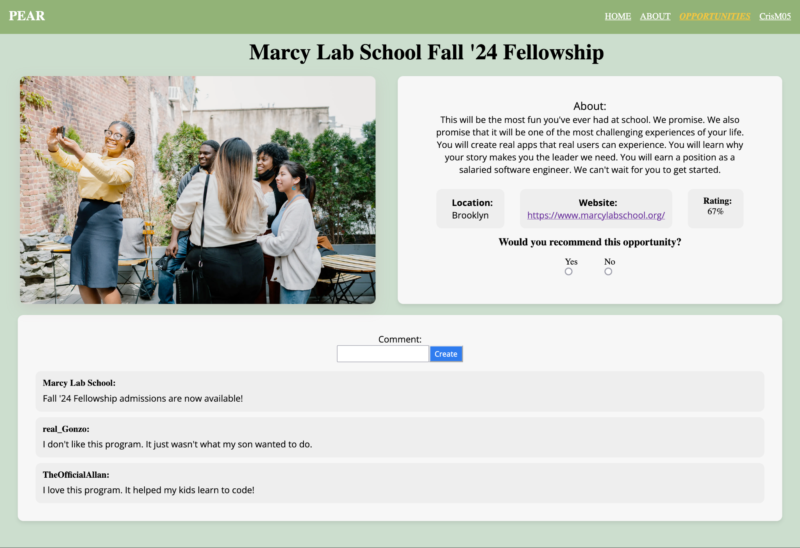

# 🍐 PEAR 

> PEAR is an application that helps low-income families find enrichment programs for their children to support their development and close the achievement and play gap.

<!-- --- -->

## ⚠️ Project Status

This repository contains the original code for the PEAR project.

A complete rewrite of this project is also underway. For the latest rewrite, please visit the **pearr** repository: [https://github.com/tailsmonster/pearr](https://github.com/tailsmonster/pearr)

---

## 📸 Screenshot




---

## ✨ The NCA Association

This project was a collaborative effort by:

- [**Nico Aroca**](https://github.com/tailsmonster) - Developer - Project Owner
- [**Allan Ramirez**](https://github.com/allancool9) - Developer - Scrum Master
- [**Cris Martinez**](https://github.com/CrisM05) - Developer (Backend Specialist)

---

## 🛠️ Technical Details 

### Tech Stack

**Frontend:** React, Vite, React Router, CSS/SCSS  
**Backend:** Express, PostgreSQL, Knex.js  
<!-- **Deployment:** Render-compatible Node web service with PostgreSQL -->

### Requirements

- Node.js 18+ recommended
- npm
- PostgreSQL running locally for development
- A PostgreSQL database for production deployment

### Environment Setup

The server reads database/session settings from environment variables. For local development, copy the template file:

```sh
cp server/.env.template server/.env
```

Then edit `server/.env` if your local PostgreSQL credentials differ.

Expected local variables:

```env
PG_HOST='127.0.0.1'
PG_PORT=5432
PG_USER='postgres'
PG_PASS='postgres'
PG_DB='kidcompass'
SESSION_SECRET='replace-with-a-local-secret'
PG_CONNECTION_STRING=''
```

The database name still uses `kidcompass` for historical compatibility.

### Local Production-Style Run

This builds the frontend and serves it through Express, which is closest to the deployed Render setup.

From the repository root:

```sh
npm run build:frontend
cd server
npm install
npm run migrate
npm run seed
npm start
```

Open the app at:

```text
http://localhost:3000
```

### Local Development Run

For development with Vite hot reload, run the backend and frontend separately.

Backend terminal:

```sh
cd server
npm install
npm run migrate
npm run seed
npm run dev
```

Frontend terminal:

```sh
cd frontend
npm install
npm run dev
```

Open the Vite URL, usually:

```text
http://localhost:5173
```

The frontend dev server proxies `/api` requests to the backend.

### Database Reset for Local Development

If local seed data conflicts with existing rows, reset the local database with:

```sh
cd server
npm run remake
```

This rolls back, migrates, and seeds the local database. Do not run this against production data.

### Build and Checks

From the repository root:

```sh
npm run build:frontend
npm run lint
```

The lint command currently passes with warnings. Warnings are mostly unused imports, console statements, and React hook dependency warnings.

### Render Deployment Notes

This repository includes a Render blueprint:

```text
render.yaml
```

<!-- For Render deployment:

1. Create or connect a Render PostgreSQL database.
2. Configure the web service with `PG_CONNECTION_STRING` from the Render database.
3. Ensure `SESSION_SECRET` exists. The blueprint can generate one.
4. Deploy using the blueprint or equivalent manual settings.

The production build runs migrations but does not run seeds. This avoids overwriting or duplicating production data. -->

### Migration Notes

Database migrations are tracked intentionally and should remain committed. They define the database schema.

Existing production databases that already ran older migrations will not automatically receive changes made to historical migration files. For an existing deployed database, add a new forward migration to alter constraints safely.

---

## 📄 Additional Resources 

- **Scrumboard:** [GitHub Project Board](https://github.com/orgs/NCA-Association/projects/1)


- **Press Release:** [PRESS_RELEASE.md](https://github.com/NCA-Association/PEAR/blob/main/PRESS_RELEASE.md)

- **Documentation:** [Project Architecture. Proposal, and Media](https://github.com/NCA-Association/PEAR/tree/main/documentation)

- **Presentation Slides + Recorded Demo:** [Google Slides](https://docs.google.com/presentation/d/1sL9noAtUQ_NCCXL1p4FnQu94JQW4o3V5ShC2L1ttxqs/edit?usp=sharing)


---

## 🤝 Contributing 

This project is now considered archived, and we are not accepting new contributions. Please refer to the **pearr** repository for the latest work.

---

## 📜 License 

This project is open-source under the [MIT](LICENSE.md) License.
